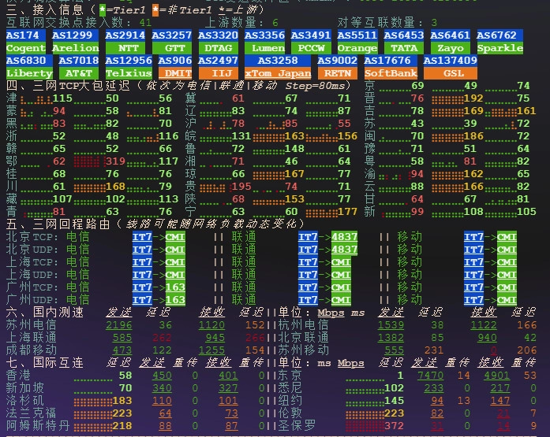
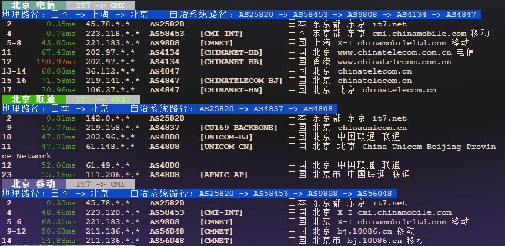
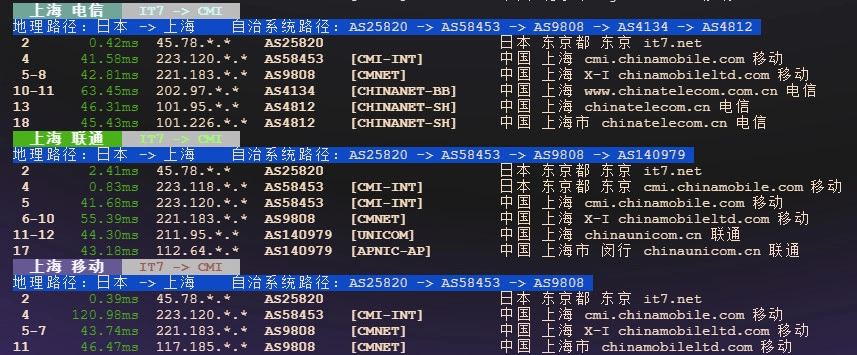
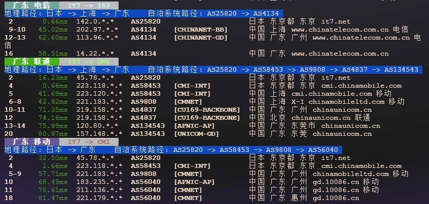

# BandwagonHost's New Tokyo DC39v2 Direct Connect VPS: The Tokyo Plan Performance Review

Looking for a Japan-based VPS with reliable direct connectivity to mainland China? You're probably tired of servers that promise low latency but deliver disappointing speeds during peak hours. BandwagonHost just launched The Tokyo Plan VPS at their DC39v2 Tokyo datacenter, featuring direct connection routes that actually work. Here's what happened when we put this new machine through its paces—spoiler alert: the numbers surprised us.

---

So BandwagonHost rolled out this new Tokyo server. Nothing flashy in the marketing, just "direct connection" and some specs. You know how that usually goes—everyone promises fast speeds until you actually try to stream something or push traffic through.

But here's the thing: this one's different.

## What You're Actually Getting

The specs read like this: 1-core AMD CPU, 1GB RAM, 20GB RAID-10 SSD storage, and 500GB monthly traffic. Annual cost sits at $79. Not the cheapest thing out there, but not trying to be.

That CPU though? Running at about 2.45GHz. Ran a Sysbench test and it scored 3679 on single-core performance. For a single-core VPS, that's honestly impressive. Like, doing-a-double-take impressive.

Disk performance? The fio test showed 4K random read/write IOPS hitting close to 70k. Sequential read/write with 1M block size both broke through 9 GB/s. That's the kind of speed where you stop waiting for things to load.

## The Connection Nobody Talks About Until It Matters

Speed tests from mainland China showed something interesting. Off-peak testing from Suzhou on China Telecom 5G: upload hit 2.2 Gbps, download reached 1.1 Gbps. Those aren't typo numbers.

Outbound routing goes through China Unicom AS4837, China Telecom CN2, and China Mobile AS9808. Return routes mainly use China Mobile's CMI, occasionally taking a detour through Telecom 163 network. Not the fanciest routes in the world, but they work.

Want to know if it's actually usable for your specific project? Testing this kind of network performance yourself beats reading anyone's review. If you're considering Japan-based hosting that maintains stable connections to China, checking out what [BandwagonHost offers in their Tokyo datacenter](https://bandwagonhost.com/aff.php?aff=79616) might save you from the trial-and-error cycle with other providers.

## Streaming and That Whole Thing

Tested the usual suspects. Unlocks Netflix (Japan region), YouTube Premium, and Amazon Prime Video. Disney+ and Spotify? Not unlocked. 

But here's the reality: every IP behaves differently. Your mileage will vary. Don't bank everything on these specific unlock results.

## The Technical Deep Dive (For Those Who Care)

Ran the full benchmark suite. Here's what came back:

**System Basics:**
- CPU: AMD EPYC-Genoa @ 2445.404 MHz
- 1 Virtual CPU
- Cache: L1: 64KB / L2: 1MB / L3: 32MB
- RAM: 1.07GB
- Storage: 20.58GB
- OS: Ubuntu 22.04 x86_64
- Virtualization: KVM
- NAT Type: Full Cone
- TCP Acceleration: BBR

**Performance Numbers:**
- Single-thread CPU score: 3679.19
- Sequential write speed: 25511.68 MB/s
- Sequential read speed: 44390.29 MB/s

**Disk I/O (via fio):**
- 4K blocks: 551.59 MB/s combined (137.9k IOPS)
- 64K blocks: 8.24 GB/s combined (128.8k IOPS)
- 512K blocks: 15.31 GB/s combined (29.9k IOPS)
- 1M blocks: 20.26 GB/s combined (19.8k IOPS)

**Network Tests to Nearby Nodes:**
- Speedtest.net: 1425.79 Mbps up / 6979.93 Mbps down / 0.76ms latency
- Tokyo: 7833.78 Mbps up / 1692.78 Mbps down / 0.38ms latency
- Hong Kong: 758.61 Mbps up / 92.29 Mbps down / 47.11ms latency
- Suzhou Telecom 5G: 2195.89 Mbps up / 1117.58 Mbps down / 35.95ms latency
- Shanghai Unicom 5G: 626.38 Mbps up / 948.31 Mbps down / 150.23ms latency

**Return Route Testing:**
- Beijing Telecom v4: Mobile CMI (standard route)
- Shanghai Telecom v4: Mobile CMI (standard route)
- Guangzhou Telecom v4: Telecom 163 (standard route)
- Most routes to mainland China use Mobile CMI
- Some Telecom destinations route through 163 backbone

**Email Port Status:**
Most major email providers' SMTP, POP3, and IMAP ports are accessible. Gmail and Yahoo have some restrictions on POP3/IMAP connections.

## What This Actually Means

The machine performs. Not in a "good enough for basic tasks" way, but in a "wait, this is what I'm paying for?" way. Direct connection routes to mainland China actually deliver the speeds they promise. Peak hour performance needs longer testing, but initial results look solid.

For anyone running services that need consistent Japan-to-China connectivity—content delivery, API hosting, that kind of thing—the routing setup here makes sense. It's not trying to be everything to everyone. Just a straightforward VPS that connects well where it matters.

---

## Bottom Line

BandwagonHost's Tokyo Plan VPS delivers on the direct connection promise with hardware performance that exceeds what you'd expect at this price point. The CPU scores high, storage screams, and network routes to mainland China actually work. If you need reliable Japan-based hosting with solid connectivity to Chinese networks, [this Tokyo datacenter setup from BandwagonHost](https://bandwagonhost.com/aff.php?aff=79616) handles the job without the usual compromises. At $79 annually, it's positioned as a practical option for projects that can't afford unreliable connections.
